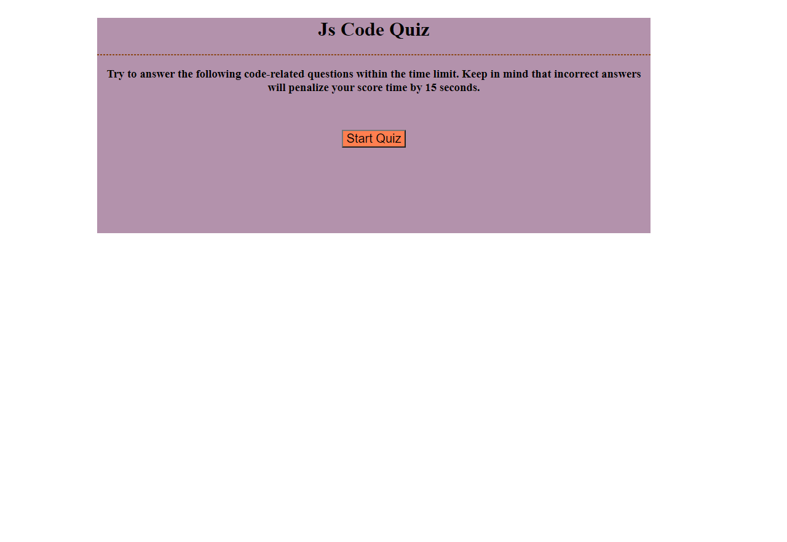

# JavaScript-Quiz-App

**User Story**

AS a coding boot camp student 
------
I WANT :  to take a timed quiz on JavaScript fundamentals that stores high scores
------
SO THAT : I can gauge my progress compared to my peers.

**Goal**

To create two html file, two javaScript file and one style sheet so that it satisfy the below given acceptance criteria.

**Acceptance Criteria**

**(1)*When I click the start button, then a timer starts and I am presented with a question.**
------
It's considered done 
------
WHEN : an index.html is created  for the landing page and all the Divs are 
       given IDs & class. 
WHEN : the index.html is given a style by creating style.css and linking it 
       to index.html. 
WHEN : In script.js all the required elements a grabbed by using 
       getElementById and stored in variable. 
WHEN : JSON.parse() method is used to get item from user data and stored in 
       a variable. 
WHEN : all the quiz questions are stored in an array. 
WHEN : an event listener is added to the start button. 
WHEN : startQuiz() function is written. 
WHEN : inside the startquic() function, quiz-info & timer display is set to 
       none for once user click on start button. 
WHEN : an event listener is added to submit score button to get its value.
        
WHEN : a gametime() function is written to set the timer. 
WHEN : scorepage() function is written to get user initial and its score. 
WHEN : localStorage.setItem() is used to stringify all user data a7 its 
       location href attribute is is provided as score.html. 
WHEN : a function is written to display the first question and its related 
       options for answer. 
WHEN : a function si written to display the rest of the questions along with 
       their options for answer. 

**(2)*When I answer a question incorrectly then time is subtracted from the clock**
------
It's considered done 
------
WHEN : inside this function, if-else statement is used to show wether the 
       answer selected is wrong or correct. 
WHEN : inside this if-else statement, the timer is decreased by a certain 
       amount for wrong answer. 

**(3)*When all questions are answered or the timer reaches 0 then the game is over**
------
It's considered done 
------
WHEN : endgame() function is written and used inside the startQuiz() 
       function. 

**(4)*When the game is over then I can save my initials and my score**
------
It's considered done 
------
WHEN : a score.html file created for the landing page so that the user can 
       see the score, go back to the start of game or can clear the previous scores. 
WHEN : another score.js file is created to keep track of all the scores and 
       player initial. 
WHEN : JSON.parse() method is used to get user data from local storage.
       and stored in a variable. 
WHEN : all the other required html elements are grabbed using document.
       querySelector. 
WHEN : a function is written to display score. 

------
Deployed application should look like the below given image. 
------

*GitHub URL to the repository*
------
https://github.com/Amit-Ranjan22/JavaScript-Quiz-App.git
------

*URL to the deployed application*
------
https://amit-ranjan22.github.io/JavaScript-Quiz-App/
------